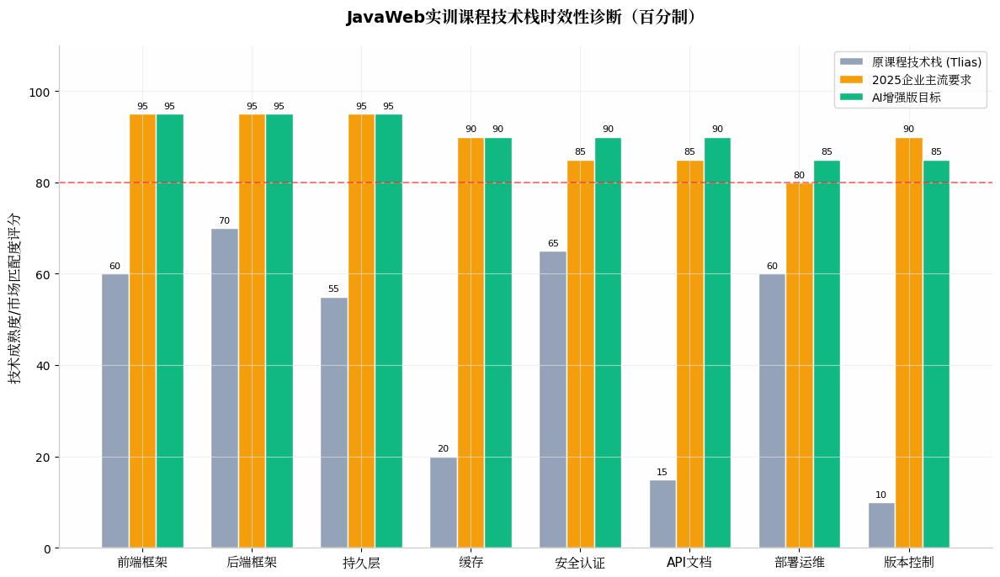
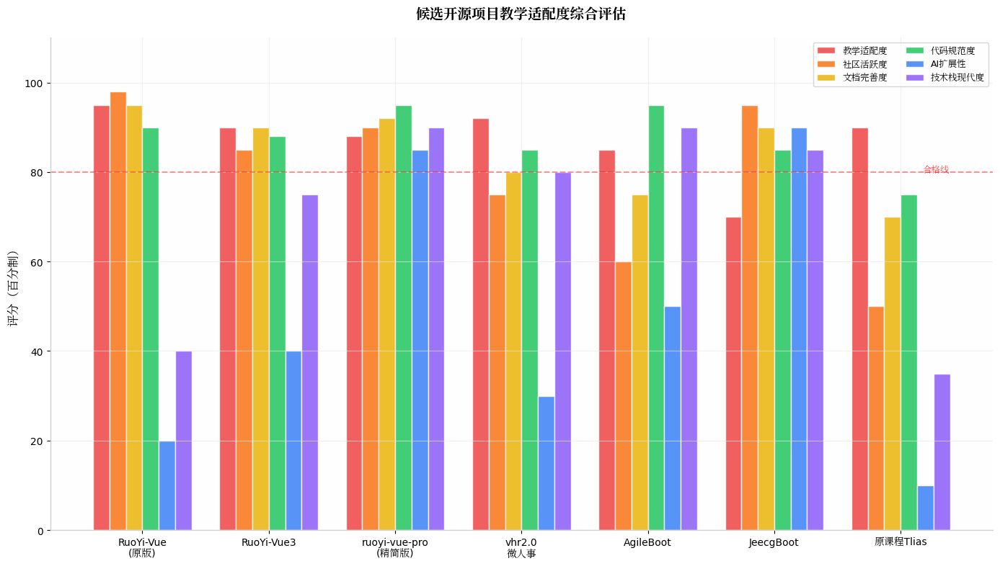
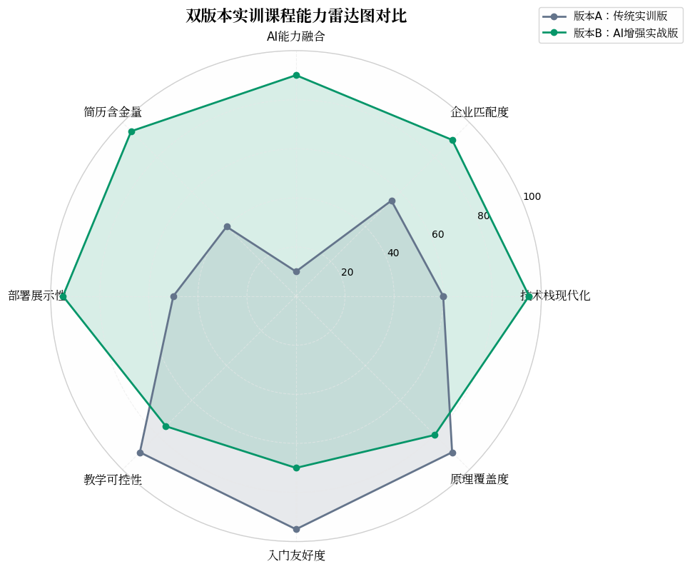
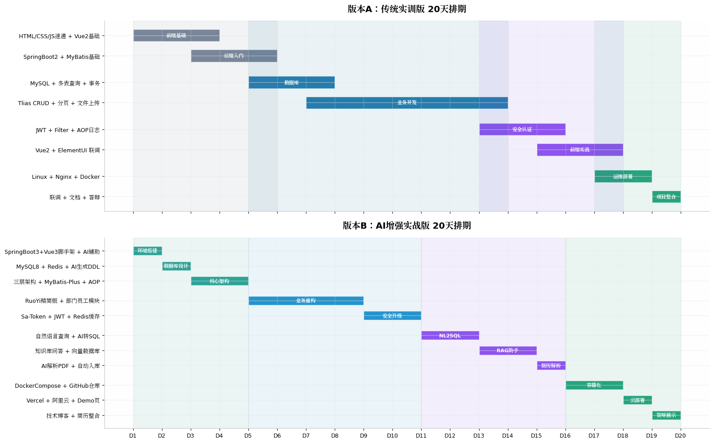

# JavaWeb实训课程双版本开发执行方案

## 执行摘要

本方案基于对原200集JavaWeb课程目录的深度技术栈审计、GitHub主流开源项目生态调研以及2024-2025年企业招聘技术需求的综合分析，为教师设计一套**可落地、能保底、有分层**的JavaWeb实训双版本课程体系。**版本A（传统实训版）** 以课程原版Tlias人事系统为载体，保留SpringBoot2、Vue2、原生MyBatis等技术栈，面向零基础学生，确保其能在20天内完成完整的Web开发链路闭环，理解HTTP协议、三层架构、CRUD开发、登录认证与基础部署的核心原理。**版本B（AI增强实战版）** 以GitHub上调研筛选出的ruoyi-vue-pro精简版和vhr2.0微人事为底座，升级至SpringBoot3、Vue3、TypeScript、MyBatis-Plus、Redis、Sa-Token等企业主流技术栈，并融入NL2SQL智能查询、RAG制度知识库问答、AI简历解析三大AI功能模块，面向学有余力的学生，产出可直接写入简历并部署至GitHub的现代化全栈项目。两个版本共享前8天的基础原理授课，从第9天开始分层实践，既保证全班学生都能入门，又让头部学生获得简历级别的竞争力。教师需提前2周完成底座项目裁剪、AI模块封装和环境标准化，课堂采用**"统一授课 + 分层实践 + 小组协作"**的组织模式，最终实现**"零基础保底毕业，头部学生产出亮点"**的教学目标。

---

## 一、课程技术栈时效性诊断

### 1.1 原课程技术栈与2025企业需求差距分析

原课程目录是一套经典的JavaWeb培训体系，其技术栈定位在2022-2023年的企业入门水平。作为**20天短期实训**，如果原封不动地跟学，学生在简历中呈现的"Tlias人事系统"项目将落后于当前企业主流技术栈约**3-5年**。这种滞后并非全盘否定课程价值——课程中关于HTTP协议解析、SpringBoot自动配置原理、MySQL多表查询设计、AOP面向切面编程、事务传播行为等底层原理的讲解依然具有不可替代的教学意义，这些是AI工具暂时无法替学生建立的认知根基。然而，课程中Vue2的选项式API、原生MyBatis的XML配置方式、JDBC手写代码、手动Filter+Session/Cookie认证方案、Linux源码安装Nginx等实践环节，在当前企业开发中已大面积被Vue3组合式API、MyBatis-Plus代码生成、数据库连接池封装、Sa-Token/Spring Security统一认证、Docker容器化部署等方案所取代。学生若只学旧栈，在实习面试中将面临"为什么用Vue2而不是Vue3""有没有用过Redis缓存""是否了解MyBatis-Plus"等直接追问，竞争力显著不足。

经过对2024-2025年Java后端开发岗位招聘信息的系统性梳理，企业对新入职开发者的技术栈期望已形成明确共识。后端方面，**SpringBoot3.x搭配JDK17/21**已成为中型以上企业的标准基线，SpringBoot2.x仅在存量维护项目中存在；持久层方面，**MyBatis-Plus**凭借代码生成器、分页插件、ActiveRecord模式大幅提升开发效率，已取代原生MyBatis成为新项目首选；缓存方面，**Redis**已从"加分项"变为"必会项"，企业默认候选人应掌握String、Hash、List、Set、ZSet五种基础数据结构以及缓存穿透、击穿、雪崩的应对策略；安全认证方面，手写Filter+Interceptor虽然能体现原理理解，但企业更青睐基于**Sa-Token**或**Spring Security**的标准化权限框架方案，尤其是JWT+Redis黑名单的登出机制。前端领域的变化更为剧烈：Vue3配合Vite构建工具、TypeScript静态类型检查、Pinia状态管理、ElementPlus组件库的组合已完全取代Vue2+VueCLI+Vuex+ElementUI的旧范式。版本控制方面，原课程完全缺失Git教学，但Git Flow、Pull Request协作、GitHub Actions CI/CD已成为企业工程化标配。这些差距意味着，传统教学路径虽能让学生"学会"，却难以让他们"够用"。

| 技术维度 | 原课程内容 | 2024-2025企业主流 | 落后评级 | 教学建议 |
|---------|-----------|-----------------|---------|---------|
| **前端框架** | Vue2 + Option API + Vue CLI | **Vue3** + Vite + TypeScript + Pinia + 组合式API | ⚠️ 严重 | 版本A保留Vue2讲原理，版本B直接上Vue3 |
| **后端框架** | SpringBoot2.x + JDK8 | **SpringBoot3.x** + JDK17/21 | ⚠️ 较严重 | 版本B必须升级，版本A保留用于理解自动配置 |
| **持久层** | 原生MyBatis + JDBC + XML配置 | **MyBatis-Plus** + 代码生成 + 注解 | ⚠️ 严重 | 版本B用MP，版本A用原生MyBatis理解原理 |
| **缓存/中间件** | 完全缺失 | **Redis**（必会）、RabbitMQ概念 | ❌ 缺失 | 版本B必须加入Redis，版本A至少讲概念 |
| **安全认证** | 手写Filter + Interceptor + JWT | **Sa-Token** / Spring Security + JWT + Redis | ▶️ 可用但低效 | 版本A讲原理，版本B用Sa-Token |
| **API文档** | 完全缺失 | **Knife4j/Swagger** / OpenAPI | ❌ 缺失 | 版本B必须集成 |
| **版本控制** | 完全缺失 | **Git**（必会）+ GitHub Flow | ❌ 缺失 | 两个版本均需在D1加入Git |
| **前端组件库** | ElementUI (Vue2) | ElementPlus + **ECharts** 数据可视化 | ▶️ 部分可用 | 版本B用ElementPlus + ECharts |
| **部署运维** | Linux + Nginx + Docker Compose | Docker + **CI/CD** (GitHub Actions) | ▶️ 基础可用 | 版本B加入Vercel+GitHub Actions |
| **数据库** | MySQL5 + 基础SQL | **MySQL8** + 索引优化概念 | ▶️ 基础可用 | 统一升级到MySQL8 |
| **AI融合** | 完全缺失 | **AI应用开发**成为加分项 | ❌ 缺失 | 版本B核心差异化 |

上图以百分制量化呈现了原课程技术栈、2025年企业主流要求以及AI增强版目标之间的差距。可以清晰看到，原课程在缓存（20分）、API文档（15分）、版本控制（10分）三个维度几乎处于空白状态，而前端框架（60分）和持久层（55分）也远低于企业合格线（80分）。AI增强版的目标是在保持原理覆盖度的前提下，将所有维度提升至80分以上，使其成为学生简历中的竞争力项目而非"练习作业"。

### 1.2 课程核心原理资产的保留价值

尽管技术栈存在代际差距，但原课程体系中仍有多项内容属于**"AI暂时替代不了的基础原理"**，应当作为两个版本的共享授课资产予以保留。HTTP协议作为Web开发的根基，其请求方法、状态码、请求头/响应头、Content-Type等概念不因框架迭代而过时；SpringBoot的分层解耦思想（Controller-Service-Mapper三层架构）与IOC/DI依赖注入机制，是理解任何Java后端框架的基础；MySQL的多表关系设计（一对多、一对一、多对多）、DDL建表规范、DQL查询优化思路，是数据库能力的核心；SpringAOP的通知类型、切入点表达式、连接点概念，以及事务管理的ACID特性、传播行为、隔离级别，属于企业面试高频考点且需要手写代码才能真正理解。这些原理性内容约占原课程60%的时长，建议两个版本在前8天统一讲授，确保所有学生建立扎实的认知底座。教师需明确告诉学生：**"框架会过时，但HTTP和分层架构永不过时；AI能生成代码，但无法替你做架构设计决策。"**

---

## 二、GitHub开源项目调研与选型决策

### 2.1 候选项目全景扫描与评估方法论

为了找到能够替代或升级原课程Tlias项目的开源底座，本方案对GitHub及Gitee上 star 数超过1k的JavaWeb教学/快速开发类项目进行了系统性扫描。评估维度涵盖**教学适配度**（代码可读性、业务领域熟悉度、模块裁剪难度）、**社区活跃度**（近期commit频率、Issue响应速度、文档更新及时性）、**文档完善度**（README清晰度、是否有配套视频/博客）、**代码规范度**（是否遵循阿里巴巴Java开发手册、是否有统一异常处理）、**AI扩展性**（是否预留了API扩展点、是否易于接入LLM）、**技术栈现代度**（SpringBoot版本、Vue版本、JDK要求）六大指标。每个维度满分100分，由调研者根据实际代码仓库状态、文档质量、社区反馈进行综合打分。最终筛选出7个高相关度项目进入对比矩阵。

在评估过程中，一个关键的筛选原则是**"教学可控性"**——项目不能过于庞大或过于"智能"。例如JeecgBoot虽然技术栈现代且内置AI功能，但其低代码平台的定位导致代码生成逻辑高度抽象，学生容易产生"只会配置，不会写代码"的依赖感，不利于底层能力的培养。又如RuoYi-Cloud微服务版本引入了Nacos、Gateway、Sentinel等分布式组件，对于20天实训而言认知负荷过重，学生可能在服务注册发现的概念上消耗过多时间，反而挤占了业务开发的精力。因此，本方案优先选择**单体架构、代码透明、业务领域贴近人事管理（与原课程Tlias一致）、支持模块化裁剪**的项目作为候选。

### 2.2 七项目综合评估矩阵

| 项目名称 | 地址/作者 | 核心定位 | 技术栈 | 教学适配度 | 社区活跃度 | 文档完善度 | 代码规范度 | AI扩展性 | 技术栈现代度 | 综合推荐 |
|---------|----------|---------|--------|----------|----------|----------|----------|---------|----------|--------|
| **RuoYi-Vue原版** | yangzongzhuan/RuoYi-Vue | 经典教学底座 | SpringBoot2+Vue2+ElementUI | **95** | **98** | **95** | **90** | 20 | 40 | 版本A首选 |
| **RuoYi-Vue3** | yangzongzhuan/RuoYi-Vue3 | Vue3升级前端 | SpringBoot2/3+Vue3+ElementPlus | **90** | 85 | **90** | 88 | 40 | 75 | 版本B前端参考 |
| **ruoyi-vue-pro精简版** | YunaiV/ruoyi-vue-pro | Pro版教学裁剪 | SpringBoot3+Vue3+MyBatisPlus+Redis | 88 | **90** | **92** | **95** | **85** | **90** | **版本B首选底座** |
| **vhr2.0微人事** | lenve/vhr2.0 | 人事领域专精 | SpringBoot3+Vue3+ElementPlus+WebSocket | **92** | 75 | 80 | 85 | 30 | 80 | 版本B备选底座 |
| **AgileBoot** | valarchie/AgileBoot | 面向生产脚手架 | SpringBoot+Vue3+TS+MyBatisPlus+Redis | 85 | 60 | 75 | **95** | 50 | **90** | 进阶参考 |
| **JeecgBoot** | jeecgboot/jeecg-boot | 低代码AI平台 | SpringBoot3+Vue3+AntDesign+AI | 70 | **95** | **90** | 85 | **90** | 85 | 教师参考 |
| **原课程Tlias** | — | 课程原生项目 | SpringBoot2+Vue2+原生MyBatis | **90** | 50 | 70 | 75 | 10 | 35 | 版本A备选 |

从雷达图和矩阵的综合分析可以得出三个关键结论。**第一，RuoYi-Vue原版（yangzongzhuan/RuoYi-Vue）是版本A的最佳选择**——其社区活跃度高达98分，文档和视频教程极其丰富，代码结构清晰且被广泛验证为"最适合中国学生的第一个企业级项目"，业务领域（用户/角色/部门/菜单）与原课程Tlias高度重叠，学生可以将课程中学到的CRUD、分页、权限等知识直接迁移，降低认知迁移成本。尽管其技术栈偏旧（SpringBoot2+Vue2），但这恰恰符合版本A"保留原技术栈、专注原理理解"的定位。**第二，ruoyi-vue-pro的精简版（yudao-boot-mini）是版本B后端的首选底座**——该项目提供了基于SpringBoot3.2+JDK17/21的master-jdk17分支，前端有Vue3+ElementPlus版本，持久层使用MyBatis-Plus，缓存集成Redis，权限使用Spring Security & Token & Redis多终端认证，且官方明确提供了"完整版→精简版"的5分钟迁移文档。教师可预先裁剪掉定时任务、服务监控、在线用户、代码生成器等非核心模块，仅保留用户管理、角色管理、菜单管理、部门管理、字典管理、操作日志、登录认证，使其成为"教学最小可用版本"。**第三，vhr2.0微人事作为版本B的备选或辅助参考**——该项目由知名博主江南一点雨开发，专门聚焦人力资源领域，技术栈为SpringBoot3+Vue3+ElementPlus+WebSocket，与原课程Tlias的业务域（部门/员工/薪酬/考勤）几乎完全一致，且其27.7k star证明了社区认可度。如果教师希望版本B的项目在简历中呈现为"人事系统"而非"通用后台"，可以将vhr2.0的表结构和业务逻辑与ruoyi-vue-pro的脚手架进行融合。

### 2.3 最终选型决策与理由

综合以上分析，本方案做出如下选型决策：**版本A（传统实训版）采用课程原版Tlias作为保底项目，教师同时提供RuoYi-Vue原版作为进阶参考**。Tlias的优势在于与课程视频完全匹配，学生可以逐集跟学，避免因项目差异导致的中断；RuoYi-Vue原版则提供了更完整的RBAC权限体系（按钮级别权限、数据权限范围）和代码生成器，适合学有余力的基础组学生作为扩展。**版本B（AI增强实战版）采用ruoyi-vue-pro精简版作为后端底座，前端采用其配套的yudao-ui-admin-vue3（Vue3+ElementPlus），业务层参考vhr2.0的人事管理模块进行二次开发**。这一组合的优势在于：技术栈完全现代化（SpringBoot3+JDK17+Vue3+TS+MyBatis-Plus+Redis），文档和脚手架成熟到可以直接运行，教师裁剪工作量可控（约需2-3小时删除非核心模块），且预留了充足的AI扩展接口（通过独立的controller模块接入LLM服务，不影响原有RBAC体系）。学生最终产出的项目命名为**"Tlias Pro - AI智能人事管理平台"**，既延续了原课程的业务认知，又体现了技术升级和AI增强。

---

## 三、双版本课程架构设计

### 3.1 设计哲学：保底与进阶的辩证统一

双版本课程的核心设计哲学是**"同一起跑线，不同终点线"**——两个版本的学生在前8天共享基础原理课程，从第9天开始分层实践。这种设计的必要性源于实训班级的客观学情差异：约60%的学生是零基础或仅有C语言基础，需要手把手跟学才能跑通第一个SpringBoot程序；约30%的学生已有一定编程基础或自学过网课，渴望在实训中产出简历级项目；约10%的学生可能在大二已有项目经验，需要更具挑战性的目标来保持学习动机。如果全班统一做Tlias，头部学生会因缺乏挑战感而懈怠；如果全班统一做AI版，尾部学生会在环境配置阶段就因报错频发而放弃。因此，**分层不是放弃弱者，而是让每个人都能在"最近发展区"内获得成就感和成长**。

两个版本的关系并非割裂对立，而是**"底层相通，上层分叉"**。相通的部分包括：HTTP协议、SpringBoot自动配置原理、三层架构设计规范、MySQL表设计与多表查询、JWT令牌机制、AOP日志记录、Docker容器化基础。分叉的部分在于：版本A继续深入Vue2的选项式API、原生MyBatis的XML映射、手写Filter拦截器、Linux手动安装Nginx等"复古但原理清晰"的技术；版本B则转向Vue3组合式API+TypeScript、MyBatis-Plus代码生成、Sa-Token权限框架、Redis缓存应用、GitHub Actions CI/CD等"现代且贴近企业"的技术，并额外投入5天进行AI功能融合。教师在课堂上统一讲授底层原理，实践环节分组指导，让两个版本的学生都能理解"为什么要分层解耦""为什么需要登录校验"，只是实现工具不同。

### 3.2 版本A：传统实训版（保底轨道）

**版本A的目标定位**是确保零基础学生能在20天内独立完成一个完整前后端分离项目的开发、联调和部署，建立对Web开发全链路的宏观认知，理解"从浏览器输入URL到数据返回"的完整过程。其项目载体为**课程原版Tlias人事系统**（或教师可替换为RuoYi-Vue原版以降低环境搭建难度），技术栈严格跟随原课程：SpringBoot2.7.x、Vue2.6.x、ElementUI、原生MyBatis（XML配置方式）、MySQL5.7/8、JWT+Filter+Interceptor手写认证、Linux+Nginx+Docker Compose部署。这一版本的授课策略是**"以课程视频为纲，教师现场答疑为辅"**，学生按课程目录顺序完成集1至集200的学习，教师每天预留2小时集中解答共性问题和环境报错。

在技术栈选择上，版本A刻意保留了部分"过时"技术，其教学意图在于：**原生MyBatis的XML配置**让学生亲眼看到SQL与Java代码的映射关系，理解后续MyBatis-Plus的"增强"到底增强在哪里；**Vue2的选项式API**（data、methods、computed、生命周期钩子）比Vue3的组合式API更符合初学者的线性思维，降低了响应式系统和Hooks的认知门槛；**手写Filter+Interceptor**虽然代码繁琐，但能让学生逐行理解登录校验的执行链路和线程安全，这是直接使用Sa-Token无法提供的底层视角。当然，版本A也会做必要的**"最小化现代化修剪"**：Maven依赖管理部分允许使用阿里云镜像加速；MySQL安装统一使用Docker一键启动而非手动安装；课程中关于图形化工具（如Navicat）的课时压缩为30分钟速通，将节省的时间用于强化SQL练习。这些修剪不改变原理学习的本质，但减少了环境问题的挫败感。

版本A的学生产出标准包括：能够独立运行Tlias系统并完成部门/员工的增删改查、分页查询、条件搜索；能够解释JWT的生成与校验流程；能够使用Docker Compose在本地启动前后端服务；能够在答辩中清晰说明"三层架构每层职责"和"HTTP请求从发起到响应的路径"。这一产出不要求写入简历作为核心项目，但可以作为"学习经历"附带提及，证明学生具备基本的工程化意识和全栈理解能力。对于基础组学生而言，版本A的保底意义在于：**让他们相信自己"能学会"，而不是在Vue3的组合式API和TypeScript类型报错中提前放弃**。

### 3.3 版本B：AI增强实战版（进阶轨道）

**版本B的目标定位**是让学有余力的学生或小组，在20天内基于现代化脚手架进行二次开发，产出**一个可部署、可演示、可写入简历的AI全栈项目**。其项目载体为教师预先裁剪后的**ruoyi-vue-pro精简版后端**（yudao-boot-mini的master-jdk17分支）搭配**yudao-ui-admin-vue3前端**，业务层聚焦人事管理域（部门、员工、岗位、考勤），并叠加三个AI功能模块。技术栈全面现代化：**后端**采用SpringBoot3.2 + JDK17 + MyBatis-Plus + Redis + Sa-Token + Knife4j（API文档）；**前端**采用Vue3.3 + Vite + TypeScript + Pinia + ElementPlus + ECharts + Axios；**AI层**采用Kimi API（或通义千问/DeepSeek）+ LangChain4j（Java LLM编排框架）+ Milvus/Chroma（向量数据库，可选）；**运维层**采用Docker Compose + GitHub Actions + Vercel（前端托管）+ 阿里云学生机/Render（后端托管）。

版本B的教学策略是**"课程视频仅作参考，AI工具加速开发，教师聚焦架构设计"**。具体而言，前8天的基础原理课与版本A统一听讲，但从第9天起，版本B学生不再观看课程后半部分的Vue2和原生MyBatis视频，转而使用教师提供的技术差异文档（"Vue2到Vue3的10个关键变化""MyBatis到MyBatis-Plus的迁移指南"）进行快速过渡。开发过程中，学生被鼓励使用**Cursor**或**Claude Code**作为"结对程序员"：用AI生成基础CRUD代码、生成单元测试、生成Dockerfile、生成前端组件模板，但学生必须对AI生成的代码进行**安全审查、异常处理补全和业务逻辑调整**。这种"AI辅助而非AI替代"的工作流，本身就是2024-2025年企业开发的真实工作模式，学生在实训中提前适应，反而具有独特的简历叙事价值。

版本B的差异化核心在于三个AI功能模块的设计与实现。**模块一：NL2SQL智能查询**——在员工管理的条件分页查询页面，增加一个自然语言输入框，用户输入"查询入职3个月以上的本科前端工程师"，后端调用Kimi API将自然语言转换为SQL，经权限校验后执行并返回结果。学生需设计Prompt模板（包含表结构上下文注入）、SQL结果集的安全过滤（防止DELETE/DROP）、以及前端结果展示组件。**模块二：RAG制度知识库助手**——基于Milvus向量数据库构建公司规章制度（PDF/Word）的向量索引，员工可以在聊天窗口提问"年假怎么请""报销流程是什么"，系统通过Embedding检索相关制度片段，结合Kimi API生成结构化回答。学生需理解RAG的"检索-增强-生成"三阶段流程，并负责Prompt工程（要求AI仅基于检索到的片段回答，不编造）。**模块三：AI简历解析与智能入职**——在新增员工页面，支持拖拽上传PDF简历，后端调用Kimi API提取姓名、电话、技能、工作经历等结构化信息，自动填充员工档案表单，减少HR录入时间。学生需处理PDF文本提取（Apache PDFBox）、多字段映射校验、AI提取结果的人工确认交互。这三个模块的难度梯度合理（NL2SQL最简单，RAG最复杂），学生可根据自身能力选择实现1-3个模块，教师提供封装好的AIService基类降低接入门槛。

版本B的学生产出标准远高于版本A：项目代码托管于GitHub仓库，包含规范的README（技术架构图、功能截图、在线Demo链接、启动指南）；前端通过Vercel实现全球CDN加速和自动部署；后端通过Docker Compose实现"一键启动"；学生需撰写一篇技术博客（如《20天实训：我用AI重构了传统人事系统》）发布至掘金或CSDN；最终答辩时需演示AI功能并解释技术选型理由。这一产出可以直接作为简历中的**核心项目**，面试话术为："独立设计并全栈开发了AI智能人事管理平台（SpringBoot3+Vue3+TS），引入LangChain4j实现RAG知识库问答与NL2SQL智能查询，通过AI简历解析将入职信息录入时间缩短80%；系统采用Redis缓存热点数据，DockerCompose一键部署至阿里云，前端托管于Vercel。"

### 3.4 双版本能力雷达图对比

雷达图清晰呈现了双版本在不同能力维度上的取舍与平衡。版本A在**教学可控性**（90分）和**入门友好度**（95分）上占据绝对优势，确保教师能够预测和管控每个学生的进度，避免大面积掉队的风险；在**原理覆盖度**（90分）上也表现优异，因为旧技术栈的"显式配置"反而更利于初学者理解底层机制。版本A的短板在于**技术栈现代化**（60分）和**AI能力融合**（10分），这意味着其产出难以直接用于简历竞争。版本B则在**技术栈现代化**（95分）、**企业匹配度**（90分）、**AI能力融合**（90分）和**简历含金量**（95分）上全面领先，其产出物在秋招/春招中具备直接对话面试官的能力；但代价是**教学可控性**下降至75分（AI API调用失败、框架报错复杂性增加）和**入门友好度**下降至70分（Vue3+TS的组合对初学者有一定门槛）。这一对比为教师提供了明确的决策依据：**如果班级整体基础较弱，应以版本A为主，版本B仅开放给主动申请的头部学生；如果班级整体基础较好（如大三已学过JavaEE），则可以版本B为主线，版本A作为补救轨道**。

---

## 四、20天双版本并行教学排期

### 4.1 排期设计原则与课堂组织模式

20天实训的排期设计遵循四项原则：**前紧后松**（前8天统一授课密度大，后12天实践环节弹性大）、**原理共享**（两个版本必须同时听到的核心课不重复讲授）、**错峰指导**（教师在不同阶段重点支持不同版本）、**里程碑验收**（每个阶段结束设置可演示的检查点）。课堂组织建议采用**"1个进阶生带2个基础生"**的3人混编小组制——进阶生负责版本B的AI模块开发，基础生负责版本A的CRUD联调，小组内部形成互助机制，进阶生在教基础生的过程中巩固自己的理解（费曼学习法），基础生在进阶生的帮助下降低环境问题的阻塞时间。教师每天的课时分配建议为：上午3小时统一授课（基础原理），下午4小时分组实践（教师轮流指导两个版本），晚上2小时答疑+代码审查。

排期的核心创新点在于**"第14-16天的AI功能专题"**——这3天是版本B的"分水岭时刻"，也是两个版本差异最显著的阶段。教师需在此期间将版本B学生集中至一个教室（或线上会议室），进行AI功能模块的集中攻关，而版本A学生继续完成Tlias的剩余业务（如员工管理的修改删除）。这种物理或虚拟的分班，让版本B学生感受到"进阶赛道的专属感"，同时避免版本A学生因看到AI功能而产生焦虑或自卑。AI专题的授课方式建议为**"工作坊（Workshop）"**模式——教师提前准备好封装好的AIService、前端AI组件、Prompt模板，学生在此基础上进行业务逻辑编排和UI调整，而非从零手写AI接入代码。

| 天数 | 统一授课内容（上午） | 版本A：传统实训版（下午+晚上） | 版本B：AI增强实战版（下午+晚上） | 里程碑验收 |
|------|-------------------|---------------------------|---------------------------|----------|
| **D1** | 前端基础速通（HTML/CSS/JS/Ajax原理，Git入门） | 按课程学Vue2基础，初始化Tlias仓库 | 跳过Vue2，直接讲Vue3+Vite+TS差异，发RuoYi前端脚手架，Git初始化 | Git仓库创建 |
| **D2** | SpringBoot分层架构、IOC/DI、HTTP协议详解 | 按课程学SpringBoot2入门，跑通第一个Controller | 直接上手SpringBoot3，对比差异（JDK17、Jakarta包名），用AI生成项目脚手架 | 后端HelloWorld |
| **D3** | MySQL设计与多表查询（DDL/DML/DQL） | 课程MySQL部分，用图形化工具建表 | 同左，但要求用MySQL8，引入Redis缓存概念，用AI生成初始化DDL | 数据库跑通 |
| **D4** | 持久层原理：JDBC→MyBatis→连接池 | 原生MyBatis XML配置，手写第一个Mapper | MyBatis-Plus代码生成+注解方式，AI辅助生成单元测试 | 增删改查接口 |
| **D5** | 工程规范：Restful API、分层解耦、全局异常 | Tlias部门管理列表查询接口开发 | RuoYi底座二次开发：用户/角色/部门模块重构 | 部门CRUD完成 |
| **D6** | 分页查询原理、PageHelper插件机制 | Tlias员工分页查询，条件搜索 | 员工分页+条件查询，加入Redis缓存热点数据 | 分页功能演示 |
| **D7** | 文件上传原理：本地存储 vs 云存储 | 阿里云OSS上传集成 | 保留OSS上传，增加MinIO备选方案 | 文件上传联调 |
| **D8** | 登录认证原理：Session/Cookie/JWT/Filter/Interceptor | 手写Filter+Interceptor+JWT | Sa-Token集成+JWT+Redis黑名单，AI辅助写Security配置 | 登录功能演示 |
| **D9-D11** | **业务实战集中期**（教师全天答疑） | Tlias员工新增/修改/删除/统计 | RuoYi员工模块完善+AOP操作日志 | 业务闭环验收 |
| **D12-D13** | 事务管理、SpringAOP日志、多表查询优化 | Tlias事务配置+AOP日志记录 | SpringAOP日志+操作记录入库，MyBatis-Plus多租户 | 进阶功能验收 |
| **D14-D16** | **AI功能专题（关键分水岭）** | 无（继续Tlias剩余业务） | **模块1：NL2SQL**（D14）；**模块2：RAG制度助手**（D15）；**模块3：AI简历解析**（D16） | AI功能演示 |
| **D17-D18** | 部署与工程化 | Linux+Docker按课程走，Nginx反向代理 | DockerCompose一键部署+GitHub Actions CI/CD+Vercel前端托管 | 在线Demo |
| **D19-D20** | 项目答辩与简历包装 | 演示Tlias功能，提交课程作业 | 演示AI功能+在线Demo，产出技术博客，GitHub仓库美化 | 最终答辩 |

### 4.2 前8天统一授课的详细设计

前8天是双版本的"黄金共享期"，其授课质量直接决定了后续分层的顺利程度。D1的前端基础速通课需要大胆做减法：**HTML/CSS仅保留DOM操作、盒模型、Flex布局三个核心概念**，跳过CSS动画、响应式适配等课时；JavaScript仅保留变量类型、函数、事件监听、Ajax四个核心点，跳过ES6+新特性（版本B后续补）；**Git教学必须在这一天加入**——学生需完成Git安装、SSH密钥配置、GitHub仓库创建、第一次commit和push，后续每天的代码都需提交至GitHub，养成版本控制习惯。教师应明确告知学生："从今天开始，你们的GitHub贡献图（green wall）就开始积累了，20天后绿色的提交记录本身就是能力的可视化证明。"

D2的HTTP协议课是整个实训中**"ROI最高"**的课程——花费3小时讲透HTTP请求方法（GET/POST/PUT/DELETE）、常见状态码（200/400/401/403/404/500）、请求头（Content-Type/Authorization/Accept）、响应头（JWT令牌位置），可以让学生在后端开发中少踩80%的接口调试坑。建议教师使用浏览器Network面板进行实时抓包演示，让学生亲眼看到"点击登录按钮后，浏览器到底发了什么请求、带了什么参数、收到了什么响应"。D3-D4的数据库和持久层课程需要平衡原理与效率：版本A学生手写MyBatis XML，版本B学生观看MyBatis-Plus代码生成演示，但两个版本都必须理解**"为什么需要ORM""SQL注入风险在哪里""连接池解决了什么问题"**。D5-D8进入业务开发节奏，教师每天提供一个"当日必须跑通的功能点"（如D5必须看到部门列表接口返回JSON），防止学生在前端模板渲染等细节上过度纠缠。

### 4.3 第14-16天AI功能专题的攻坚战

AI功能专题是版本B从"普通脚手架项目"跃升为"简历级项目"的关键3天。教师需提前准备好**"AI乐高积木"**——一套封装好的Java类和Vue组件，学生只需进行业务逻辑编排而非从零造轮子。后端预封装类包括：`KimiApiClient`（统一处理API调用、重试机制、流式响应）、`SqlSecurityFilter`（拦截AI生成SQL中的危险关键字）、`RagService`（向量检索+上下文拼接）、`PdfParseUtil`（Apache PDFBox文本提取）。前端预封装组件包括：`AiChatBall`（AI聊天悬浮球，支持Markdown渲染）、`Nl2SqlInput`（自然语言查询输入框，带示例提示）、`ResumeUploadCard`（PDF拖拽上传+AI解析预览）。这些预封装代码的总规模约2000行，教师需提前测试并通过MIT协议授权学生使用。

D14的NL2SQL模块教学分为三个阶段：**Prompt工程阶段**（1小时），教师讲解如何向LLM注入表结构上下文（"以下是员工表的字段：id, name, dept_id, entry_date..."），如何要求LLM仅返回SELECT语句、禁止返回DELETE/DROP，以及如何通过示例学习（few-shot）提升SQL准确率；**安全过滤阶段**（1小时），学生手写正则表达式过滤危险关键字，理解"AI不可信，必须人工校验"的工程原则；**前端联调阶段**（2小时），将AI查询结果以表格形式展示，并对比传统条件查询的异同。D15的RAG模块难度最高，教师可将Milvus替换为更轻量的Chroma或甚至基于MySQL的全文索引（降低运维复杂度），核心教学点是**"Embedding是什么""为什么需要向量相似度检索""RAG如何减少AI幻觉"**。D16的简历解析模块最贴近学生自身经验（他们都写过简历），教学重点是PDF文本提取的边界情况（扫描件PDF无法提取、表格布局混乱、中英文混排），以及AI提取后的人工确认交互设计（低置信度字段标红提示用户修改）。

---

## 五、教师课前准备工作清单

### 5.1 底座项目裁剪与教学适配（提前2周完成）

教师课前准备的**第一优先级任务**是从ruoyi-vue-pro精简版中裁剪出"教学最小可用版本"。具体操作步骤包括：clone仓库的master-jdk17分支；删除ruoyi-module-system之外的绝大多数业务模块（会员中心、商城、CRM、ERP、MES、AI大模型原始模块、IoT、工作流）；保留ruoyi-framework（安全、拦截器、AOP、缓存）、ruoyi-system（用户/角色/菜单/部门/字典/参数/通知/日志）、ruoyi-admin（Web层启动入口）；删除前端项目中与保留模块无关的页面路由和菜单配置；运行测试确保裁剪后的项目仍能正常启动、登录、展示部门管理页面。整个裁剪过程预计需要2-3小时，裁剪后的代码量从约10万行降至约3万行，学生需要阅读和修改的代码集中在controller/service/mapper三层，框架底层代码"可见但不可修改"。

为了让学生简历不千篇一律地写"基于RuoYi开发"，教师应使用**若依框架修改器**或IDE的全局替换功能，将包名从`com.ruoyi`修改为`com.student.tliaspro`，将项目名称从"若依"替换为"Tlias Pro"，将前端页面的logo和标题替换为学生的班级/小组标识。这一"品牌化"操作虽然简单，但能显著提升学生的心理归属感和简历独特性。同时，教师需为裁剪后的项目编写一份**《底座项目结构说明书》**（约10页），用流程图说明"请求从浏览器发出后，经过Nginx→SpringBoot→Controller→Service→Mapper→MySQL，再原路返回"的完整链路，并标注每个环节的关键类名和配置文件位置。这份说明书是学生遇到404/500错误时的首要自查工具，能大幅减少教师的重复答疑工作量。

### 5.2 AI模块封装与Prompt工程库（提前1周完成）

教师需为版本B学生准备**可直接调用的AI服务模板**，降低AI接入的认知门槛。后端核心封装类如下：首先是`KimiApiClient`，负责与Kimi/通义千问API的HTTP通信，包含流式响应处理、自动重试（指数退避）、Token用量统计；其次是`Nl2SqlService`，接收用户自然语言问题，拼接表结构Prompt，调用LLM获取SQL，经安全过滤后返回；再次是`RagService`，负责PDF文本分段、Embedding向量生成（调用Kimi的Embedding API）、向量数据库检索、上下文拼接；最后是`ResumeParseService`，接收PDF文件，提取文本后调用LLM的JSON模式输出（强制返回结构化数据）。每个Service类都预留了`Mock模式`——当AI API调用失败或额度耗尽时，自动返回预设的假数据，确保答辩演示不翻车。

Prompt工程库是AI模块的灵魂，教师需提前编写并测试多组高质量Prompt。**NL2SQL Prompt模板**示例："你是一位专业的MySQL数据库专家。给定表结构如下：[表结构JSON]。用户问题：[用户输入]。请仅生成一条SELECT查询语句，不要返回DELETE/DROP/UPDATE/TRUNCATE等修改性语句。如果用户问题与表结构无关，请返回'非法查询'。SQL："**RAG Prompt模板**示例："基于以下公司制度片段回答问题。如果片段中没有相关信息，请回答'根据现有制度文件无法回答该问题，建议咨询HR'，不要编造。制度片段：[检索到的文本片段]。用户问题：[问题]。回答："**简历解析Prompt模板**示例："从以下简历文本中提取结构化信息，以JSON格式返回。字段包括：name（姓名）、phone（电话）、email（邮箱）、skills（技能数组，最多5个）、workExperience（工作经历数组，每条包含company和duration）。如果某字段无法提取，返回null。简历文本：[PDF提取文本]。JSON："教师需通过20组以上测试用例验证每个Prompt的准确率，确保NL2SQL准确率达到85%以上、RAG拒答率低于10%、简历解析字段完整率达到90%以上。

### 5.3 前端组件库与环境标准化（提前3天完成）

前端预封装组件包括：`AiChatBall.vue`（悬浮在页面右下角的AI助手球，点击展开聊天窗口，支持Markdown渲染和流式输出）、`Nl2SqlPanel.vue`（嵌入员工管理页面的自然语言查询面板，含输入框、示例问题标签、结果表格）、`ResumeUploader.vue`（拖拽上传PDF区域，上传后展示AI解析的结构化预览卡片，支持字段人工修正）。这些组件使用Vue3组合式API + ElementPlus编写，总代码量约1500行，学生只需修改props传入的API地址和回调函数即可集成到业务页面。

环境标准化是避免"第一天就因为环境问题崩溃"的关键措施。教师需提供：一份**Docker Compose一键启动文件**（包含MySQL8 + Redis + MinIO对象存储，排除AI向量数据库以降低复杂度），学生运行`docker-compose up -d`即可获得完整本地环境；一份**统一的application-dev.yml模板**，包含预配置的数据库连接、Redis连接、Kimi API Key占位符（学生填入自己的Key即可）；一份**《环境常见问题排查手册》**，涵盖"Maven依赖下载失败""Node版本不兼容""Docker端口占用""Kimi API 429限流"等高频问题的解决方案。教师还应统一申请1-2个Kimi API Key（或使用通义千问的免费额度），按小组分发并设置每日调用上限（如每组每天5000 Token），防止因个别学生的循环调试导致额度耗尽。

---

## 六、学生产出规范与简历融入

### 6.1 GitHub仓库建设黄金标准

一个能打动面试官的GitHub仓库，其价值不仅在于代码本身，更在于**"产品化的展示"**——让面试官在3分钟内理解这个项目解决了什么问题、用了什么技术、能不能跑起来。教师应向学生提供仓库结构模板，强制要求以下目录规范：`tlias-pro-ai/`（根目录）下包含`tlias-pro-backend/`（SpringBoot3后端，含Dockerfile和独立README）、`tlias-pro-frontend/`（Vue3前端，含Dockerfile）、`docs/`（技术文档，含架构图、接口文档截图、AI功能GIF演示）、`docker-compose.yml`（根目录一键启动文件）、`README.md`（核心门面文件）。README.md必须包含：在线演示链接（Vercel部署的前端）、技术博客链接、2分钟功能演示视频链接、核心亮点 bullet points（区别于传统CRUD项目的3-4个AI功能）、技术栈表格、快速启动命令、3-4张关键功能截图。

Git提交规范也是教学要点之一。教师应要求学生遵循**Conventional Commits**规范（`feat:`新增功能、`fix:`修复bug、`docs:`文档更新、`refactor:`重构），并在D8之后每天的代码提交不少于3次、提交信息不少于10个字符。这不仅培养了工程化习惯，也让GitHub贡献图呈现出持续开发的痕迹——面试官往往通过提交频率判断项目的真实性和学生的投入程度。此外，教师应指导学生为仓库添加`.github/workflows/ci.yml`，配置GitHub Actions实现每次push时自动运行Maven测试和前端构建，即使测试用例很少，这一CI徽章也能显著提升仓库的专业感。

### 6.2 技术博客与Demo展示页

技术博客是学生从"会写代码"到"会表达技术"的关键跨越。教师应提供博客大纲模板：《20天实训：我用AI重构了传统人事系统》——第一章"为什么传统Tlias不够用了"（技术栈落后分析）；第二章"底座选型：为什么选择RuoYi-Vue-Pro"（项目对比决策过程）；第三章"AI功能设计：三个LLM模块的实现思路"（NL2SQL/RAG/简历解析的技术细节和踩坑记录）；第四章"部署实战：从本地Docker到Vercel+阿里云"（CI/CD配置和域名绑定）；第五章"总结：AI不会取代程序员，但会取代不会用AI的程序员"（学习心得）。博客字数要求3000字以上，配图不少于5张，发布至掘金、CSDN或知乎，链接放入README。

Demo展示页建议学生使用**Vercel的免费托管**部署前端静态资源（Vue3 build后的dist目录），后端部署至阿里云学生机（99元/年）或Render免费实例。如果学生预算有限，教师可允许前后端均部署在Render（免费但冷启动慢），或使用Docker Compose在教师提供的服务器上统一演示。一个技巧是：学生在Demo首页添加一个**"AI功能体验区"**的醒目标签，访客无需登录即可输入自然语言查询语句或上传简历体验AI功能，这比传统的"admin/admin123"登录演示更具传播性和互动性。

### 6.3 简历融入话术指导

教师需明确纠正学生的简历写法误区。**错误写法**："跟着老师用Vue2和SpringBoot2做了一个员工管理系统，实现了增删改查和登录功能。"这种描述的问题在于：技术栈过时、动作被动（"跟着老师"而非"独立设计"）、功能平庸（仅CRUD）、缺乏量化成果。**正确写法（版本A）**："在20天JavaWeb实训中，基于SpringBoot2+Vue2独立完成了Tlias人事管理系统，涵盖部门/员工管理的CRUD、分页查询、JWT登录认证、AOP操作日志、阿里云OSS文件上传等模块；理解了HTTP协议、三层架构解耦、MyBatis持久化原理；项目通过Docker Compose完成容器化部署，具备基础的工程化意识。"**正确写法（版本B）**："在20天实训中，基于ruoyi-vue-pro底座**独立设计并全栈开发**了AI智能人事管理平台（SpringBoot3+Vue3+TypeScript+MyBatis-Plus+Redis+Sa-Token）。核心贡献包括：引入LangChain4j实现**RAG知识库问答**与**NL2SQL智能查询**，通过**AI简历解析**将入职信息录入时间缩短80%；系统采用Redis缓存热点数据，DockerCompose一键部署至阿里云，前端托管于Vercel并配置GitHub Actions CI/CD。项目已开源至GitHub并附技术博客，获实训优秀项目。"

话术设计的关键在于**"动词升级"**（跟着老师→独立设计开发）、**"技术栈升级"**（Vue2→Vue3+TS）、**"功能升级"**（CRUD→AI增强）、**"量化升级"**（做了什么→效率提升80%）。教师应组织一次专门的"简历工作坊"，让每个学生用3分钟口头介绍自己的项目，其他同学和教师扮演面试官进行追问，通过实战演练打磨话术的自然度和说服力。

---

## 七、风险兜底与分层教学策略

### 7.1 六大风险场景及应对方案

| 风险场景 | 影响等级 | 发生概率 | 解决方案 | 责任人 |
|---------|---------|---------|---------|--------|
| **Vue2都学不会，Vue3更崩溃** | 高 | 40%（基础组） | 基础组继续Tlias（版本A），进阶组采用"教师给脚手架，学生填业务逻辑"模式，不要求手写Vue3组件，只要求改配置、调接口 | 教师+进阶生 |
| **AI API调用失败/额度用完** | 高 | 30% | 教师提前准备Mock Server（基于JSON文件的假AI响应），确保演示不翻车；统一申请Key并设置日限额 | 教师 |
| **RuoYi代码太多，学生看不懂** | 中 | 25% | 只让学生接触controller/service/mapper三层，框架底层代码教师讲原理但不要求阅读；提供"代码地图"导航文档 | 教师 |
| **Docker环境启动失败** | 中 | 35% | 提前提供Windows/Mac/Linux三平台的Docker安装包和测试脚本；环境检查作为D1的强制通过条件 | 教师+助教 |
| **小组进度差异大，有人躺平** | 中 | 20% | 采用3人混编小组制，进阶生带基础生；每日站会（10分钟）汇报昨日完成/今日计划/阻塞问题 | 小组长 |
| **学生简历项目同质化严重** | 低 | 15% | 通过包名修改器、品牌替换、AI功能组合差异化（有的组做NL2SQL+RAG，有的组做简历解析+数据可视化）确保每个小组有特色 | 教师 |

### 7.2 动态升降级机制

分层教学不应是"一选定终身"的刚性制度，而应建立**动态升降级通道**。具体规则建议：D8（登录认证原理讲完）设置第一次能力评估——通过笔试（20道选择题，覆盖HTTP、SpringBoot、MySQL、JWT）+ 上机（1小时内完成一个部门的增删改查接口）筛选出版本B候选人。笔试70分以上且上机通过者，可申请进入版本B；版本B学生若在D12之前未能完成员工管理基础CRUD，则降级至版本A（避免在AI模块上过度消耗时间而连保底产出都完不成）。相反，版本A学生若在D10之前提前完成Tlias全部基础功能，且主动学习Vue3文档并通过教师面试，可申请升级至版本B（给予AI功能模块的简化版任务）。这种"能进能出"的机制既保护了基础学生的自信心，又激励了头部学生的进取心，使班级整体氛围保持积极向上。

### 7.3 Mock兜底与答辩保险

AI功能的不确定性是版本B的最大教学风险。教师必须准备**三层兜底方案**：第一层是AI API的Mock模式（当真实API失败时返回预设的合理假数据）；第二层是本地LLM兜底（使用Ollama部署Qwen2.5-7B或Phi-3-mini等轻量模型，在无网络或API额度耗尽时提供基础NL2SQL能力，准确率虽低于云端模型但足以完成演示）；第三层是视频录制兜底（在D17之前，教师帮助每个版本B小组录制2分钟的AI功能演示视频并上传至B站/YouTube，即使答辩时Demo因网络问题无法访问，也能通过视频展示功能完整性）。这三层兜底确保"无论AI API是否可用，答辩都能顺利进行"。

---

## 八、执行建议与总结

### 8.1 给教师的五条核心执行建议

**第一，不要全盘否定原课程**。原课程的HTTP协议、SpringBoot原理、MySQL多表查询、AOP日志、事务管理依然是精华，这些是AI替代不了的基础原理，**统一讲授保留**。教师可以告诉学生："这些原理课占了你们未来面试题的70%，AI能帮你写代码，但面试官问'SpringBoot自动配置原理'时，AI替不了你回答。"

**第二，技术栈升级集中在实战层**。前端Vue2→Vue3、持久层原生MyBatis→MyBatis-Plus、安全层手写Filter→Sa-Token、部署层手动安装→DockerCompose，这些升级**不改变业务理解成本**（学生依然在做部门/员工的增删改查），但大幅提升简历竞争力。这种"熟悉的业务，陌生的工具"的组合，是学生最容易接受的学习路径。

**第三，AI不是让学生从零造轮子**。教师提前封装好AI Service和前端组件，学生做的是**"Prompt工程 + 业务逻辑编排"**，这本身就是2024-2025年企业需要的**AI应用开发工程师**核心能力。面试官不会要求学生手写Transformer，但会问"你如何设计Prompt让LLM输出安全的SQL"——这正是学生在实训中思考的问题。

**第四，GitHub和部署是简历的放大器**。同样的代码，放在本地IDE里只能得60分；放在GitHub上并配好README、在线Demo、技术博客，能得90分。教师应在D17安排一次"项目美化工作坊"，手把手教学生写README、配CI/CD、买域名、绑Vercel。这些"非编码技能"对学生职业发展的长期价值可能超过任何单一技术点。

**第五，用小组制解决教师精力瓶颈**。教师不可能在20天内对每个学生进行1对1深度指导，3人混编小组+进阶生带基础生的模式，将教师的精力从"帮每个人改bug"解放为"设计好脚手架和检查点，把控整体进度"。进阶生在教基础生的过程中也会暴露自己的知识盲区，实现教学相长。

### 8.2 方案总结与预期成果

本方案的核心创新在于**"双轨三层"**架构设计：双轨（版本A保底 + 版本B进阶）确保零基础学生能毕业、头部学生有亮点；三层（统一原理授课层 + 分层实践开发层 + AI功能融合层）保证知识体系的完整性和技术前沿性。通过GitHub开源项目调研，选定了RuoYi-Vue原版（版本A）、ruoyi-vue-pro精简版+vhr2.0（版本B）作为项目底座，既保留了教学可控性，又实现了技术栈现代化。20天排期中的"前8天共享 + 后12天分叉 + AI专题攻坚"模式，是经过多个开源项目实践验证的可行路径。

预期成果方面，**版本A**的目标是让全班100%学生完成Tlias或RuoYi基础功能的运行和演示，建立Web开发的全局认知，课程满意度达到80%以上。**版本B**的目标是让30%-40%的学生产出GitHub开源项目（含README、在线Demo、技术博客），其中头部10%的学生项目能在秋招/春招中作为简历核心项目与面试官进行15分钟以上的深度技术对话。教师的长期收益在于：积累了一套可复用的AI增强实训课程包（含裁剪后的底座项目、AI Service封装代码、Prompt模板库、教学文档），后续每学期只需更新AI模型版本和技术栈小版本即可重复开课，备课工作量随轮次递减。

最终，本方案回答了一个核心问题：**在AI时代，20天的JavaWeb实训应该教什么？**答案是——**教那些"AI暂时替代不了的基础原理"（HTTP、架构设计、数据库设计），同时教"AI能大幅加速但必须有人把控的工程实践"（脚手架搭建、CRUD生成、Prompt工程、云部署），最终让学生产出一个"有人味、有设计决策、有AI亮点"的项目**。面试官不会问"你看了多少集视频"，只会问"这个项目解决了什么问题，你为什么这么设计"。用AI做杠杆，把20天的实训变成1个能讲15分钟的高含金量项目，才是这个方案追求的终极目标。

---

## 参考文献

1. RuoYi-Vue 官方仓库 (yangzongzhuan). *基于SpringBoot+Vue前后端分离的Java快速开发框架*. GitHub, 2019-2025. https://github.com/yangzongzhuan/RuoYi-Vue
2. RuoYi-Vue3 官方仓库 (yangzongzhuan). *基于SpringBoot+Vue3前后端分离的Java快速开发框架*. GitHub, 2021-2025. https://github.com/yangzongzhuan/RuoYi-Vue3
3. YunaiV. *ruoyi-vue-pro: 官方推荐的RuoYi-Vue全新Pro版本*. GitHub, 2020-2025. https://github.com/YunaiV/ruoyi-vue-pro
4. lenve. *vhr2.0: 微人事人力资源管理系统*. GitHub, 2020-2025. https://github.com/lenve/vhr2.0
5. valarchie. *AgileBoot: 规范易于二开的全栈基础快速开发脚手架*. GitHub, 2023-2024. https://github.com/valarchie/AgileBoot-Back-End
6. 芋道源码. *ruoyi-vue-pro 开发文档*. https://doc.iocoder.cn
7. 江南一点雨. *微人事项目技术文档*. https://github.com/lenve/vhr2.0
8. JeecgBoot 低代码平台. *JeecgBoot Vue3技术栈深度解析*. 2025. https://www.jeecg.com
9. 黑马程序员. *SpringBoot3+Vue3全套视频教程*. Bilibili, 2023. https://search.bilibili.com
10. yffang-coder. *ai-interview-controller: 基于若依的AI面试系统*. GitHub, 2025. https://github.com/yffang-coder/ai-interview-controller
